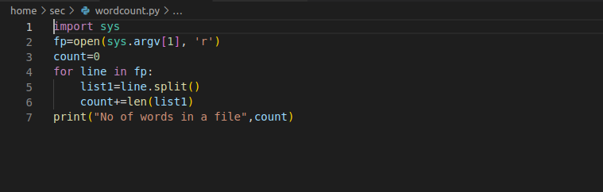
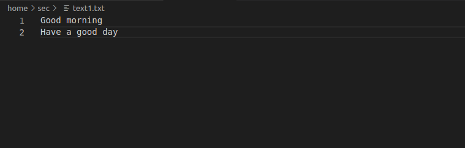
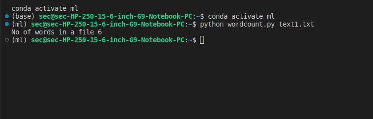

# command-line-arguments-to-count-word
## AIM:
To write a python program for getting the word count from the contents of a file using command line arguments.
## EQUIPEMENT'S REQUIRED: 
PC
Anaconda - Python 3.7
## ALGORITHM: 
### Step 1:

Import sys module

### Step 2: 
 
Open the file with sys.argv[1]

### Step 3: 

Use the for loop to select the content in file

### Step 4:  

Use split function to to separate the file content into words or strings

### Step 5: 

Count the length of the words using len

### Step 6: 

Print the number of words

## PROGRAM:
```
Program for getting the word count from the contents of a file using command line arguments
Developed by: lisiana t
RegisterNumber: 212222240053

import sys
fp=open(sys.argv[1], 'r')
count=0
for line in fp:
    list1=line.split()
    count+=len(list1)
print("No of words in a file",count)

```
### OUTPUT:







## RESULT:
Thus the program is written to find the word count from the contents of a file using command line arguments.
